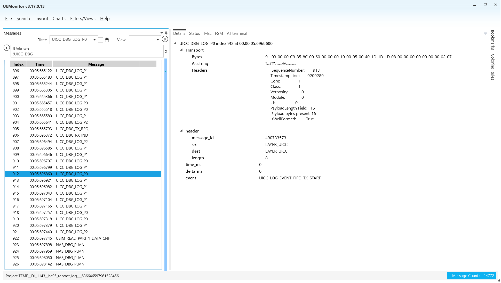
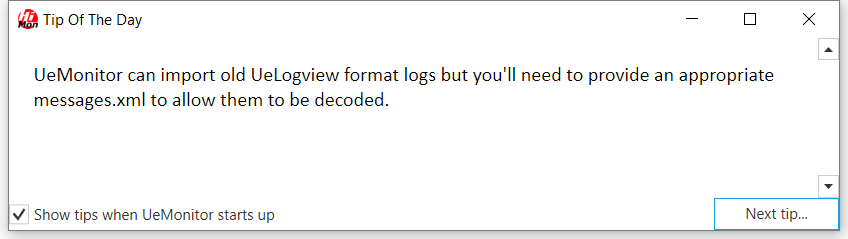
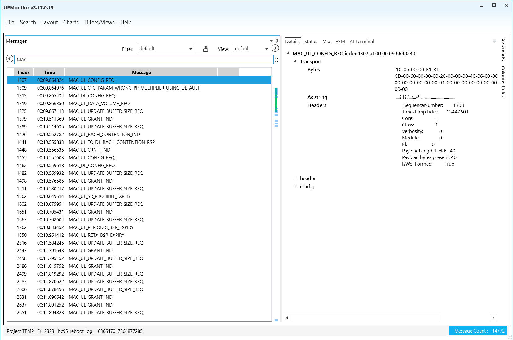
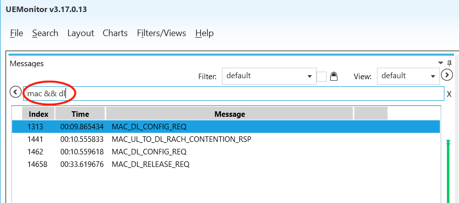
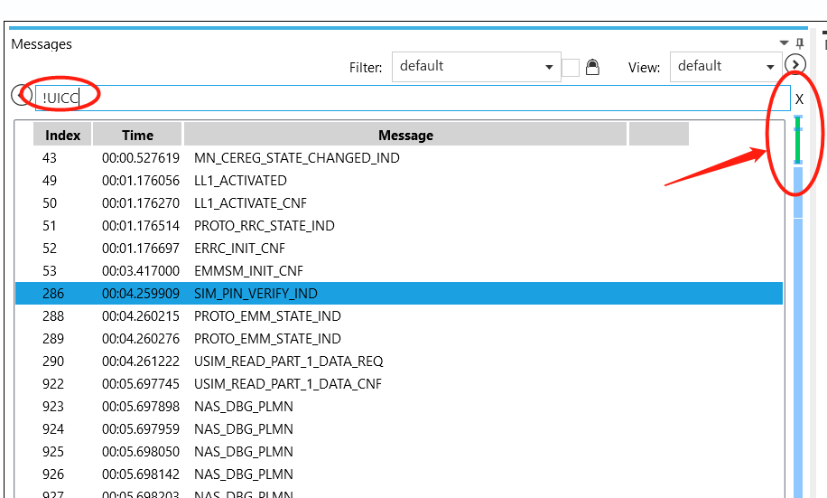
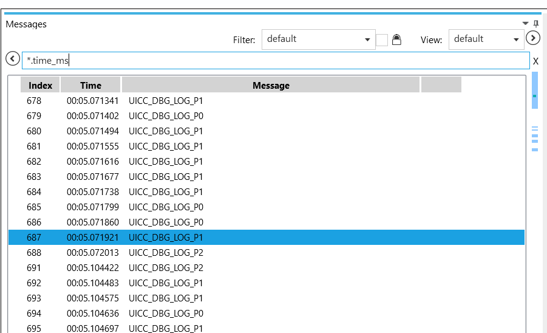
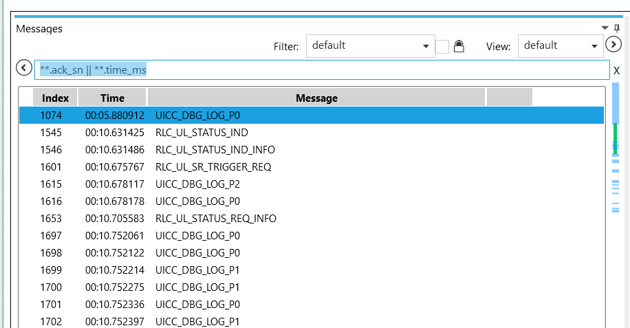

# About

UEMonitor is a software developed by Quectel. It uses the `messages.xml` file coming with the UE firmware to decode and format the debug messages from the Quectel UE.

To the best of my knowledge, this software is only mentioned in some documents, but is not really publicly available. My UEMonitor version is **v3.17.0.13**. If you want a copy, you could send me an email (lanternd1028 at gmail). Or you can directly ask Quectel support for the latest version.

The `messages.xml` decoder file is device-specific. For example, if you want to view the log from BC95, then you need the `messages.xml` for BC95. Usually the decoder also depends on firmware version. However, I haven't tried to decode the log with a different version decoder yet, so I don't have a conclusion here.

Btw, If you have ever heard **Neul UELogViewer**, forget about it. It is super hard to use. You can consider the UEMonitor as the official successor of the UELogViewer.

# Instructions

## Main Window Basics

So first of all, I introduce the main window. See the picture below.

Click `File` -> `New Project` -> `From log file`, then you are able to load files from QCOM or UELogViewer. Otherwise just choose `From UE debug port`. Next, choose the correct decoder. and you are good to go. It is not hard to navigate and use.

The left panel with lots of logs is called "Summary list display" or "Summary window" (They called it this way).

Let's discuss the tab on the right window frame.

-   Details: shows you the raw and decoded message from the log. The most frequent one that you might use.
-   Status: Nothing to show, I believe you need to choose "From UE debug port" to enable it.
-   MSC: shows the message flows among the layers. Some messages are logged in its own layer, while some are passed between layers. It is a good visualization tool.
-   FSM: finite state machine. Needs some settings to enable. No idea yet.
-   AT terminal: works only in debug port logging mode.
-   Chart: shows the timeline of the message type you drag from the summary view. You can add a chart tab from the "Charts" menu.

## Tips from the UEMonitor Help

It is strange that, the developer of the UEMonitor organized the valuable help information as "Tip Of The Day". You can only view the tip piece by piece like the picture below.

Next I list all the possible "Tips" from the software. There is no specific order of them. I just do the copy and paste.

---

-   UeMonitor can import old UeLogview format logs but you'll need to provide an appropriate `messages.xml` to allow them to be decoded.
-   When you *export* a project, bookmarks and other project-specific settings are saved with it so it's a good way to share information.
-   Use *0x* for hexadecimal values in filter expressions.
-   You can use the wildcard syntax to select fields across multiple messages. For example
    
    > \*.rssi
    
    matches all messages that contain a top-level field called "rssi". Double wildcards can be used to match fields at any level:
    
    > \*\*.rssi
-   You can change the size of the font used in the summary list display by using the larger/smaller buttons to the right of the view selector.
-   Double-clicking on a message in the summary window creates a new pinned view of it. (tested, not working)
-   You can choose a custom format for displaying message fields or quickly toggle between hex and decimal views. (Right click or `Ctrl+X`)
-   You can add bookmarks to logs using the bookmarks feature. You can add notes to bookmarks and show these in the summary window.
-   The summary display allows you to show message fields. Right click on a field in the details pane and select "Show in summary list".
-   You can copy the contents of structure in the details panel or even drag a structure name into the summary view to include all the fields within that structure.
-   You can use wildcard expressions in field templates. For example:
    
    > \*.header.message\_id
    
    will show the id of all messages.
-   If you forget to save a temporary project and want to return to it, you can use the "show temporary files" option in the Open-Project dialog.
-   You can export messages to a text file using the *Export Data* command. The command uses the current filter and column settings so you can use the summary window to preview the output.
-   As well as the standard numeric operators, filter expressions allow string and bitwise comparisons.
-   You can drag log files of all kinds into UeMonitor to open them. You can also drag an `xml` file with a log file. If you drag a file called "Open\_COMn.txt" into UeMonitor, a new project will be started on that com port.
-   The navigation bar on the right of the summary list is not a scroll bar - just click on it to move your position in the log.
-   To synchronise the summary list with a chart, just right-click on the chart.
-   You can create new custom views by pressing the '+' button next to the view name.
-   You can plot more than one field in the same chart - just drag the field from the details pane and drop it in the chart window.
-   You can combine conditions within filters using the `&&` and `||` operators. The `!` (not) operator is also supported.
-   You can colour messages by right-clicking on a field in the details pane.
-   When you copy messages from the summary window, the copied text includes the columns you've selected.
-   A filter expression that does not contain a '.' is treated as a query against all messages whose name contains the expression. For example:
    
    > ll1 &#124;&#124; asn
    
    matches all LL1 messages and those whose name contains 'asn'.
-   You can *goto* a particular message index. (Shortcut: `Ctrl+G`.)
-   By default, temporary projects are automatically deleted 1 week after their last access date.
-   You can use the `Home`, `End`, `PageUp`, and `PageDown` keys on the keyboard to navigate through a log.
-   The following operators are supported in filter expressions&#x2026;
    -   Numeric
        -   `==`
        -   `!=`
        -   `>`
        -   `<`
        -   `>=`
        -   `<=`
    -   String
        -   `eq` - is equal to
        -   `ne` - is not equal to
        -   `~` - contains substring
        -   `!~` - does not contain substring
    -   Bitwise
        -   `bs` - has bits set
        -   `bc` - has bits clear
-   String operators in filter expressions are case-sensitive.
-   You can save/restore the column layout in the message summary list using the Field Template manager.
-   You can change the format of the time column between a date and a relative time.
-   You can zoom into a chart by left-clicking and 'dragging' across the section you are interested in. Return to the original zoom level using the 'Back' button.
-   You can COUNT messages matching a particular filter using the Functions tab in the search dialog. Other functions include
    -   SUM - sums the value of the filtered field
    -   MIN - returns the minimum value of the filtered field
    -   MAX - returns the maximum value of the filtered field
    -   MEAN - returns the mean value of the filtered field
    -   DISTINCTVALUES - returns the number of distinct values of the filtered field
-   You can lock filters to prevent them accidentally being modified.
-   Filters can be saved and reloaded using the Filter Template manager.
-   You can drag field names from the details window to the filter box.
-   You can use the names of enumerated values instead of numeric values.
-   The strings `true` and `false` can be used for boolean values.
-   UeMonitor can obtain `messages.xml` from a firmware package file (.fwpkg).
-   You can customise the fields that are shown in the summary window.
-   You can filter by text strings - use the '~' operator like this:
    
    > application\_report.message ~ "power"
-   You can change the format of message timestamps by right-clicking on a a message in the summary view and selecting "Time format&#x2026;".
-   Double-clicking on a message in the summary window creates a new pinned view of it.
-   You can *search* for a message using the same syntax as used for filtering. Alternatively the *free text* search will look for strings within the text representation of the message (but be warned this is much slower than searching for fields).
-   You can see a new tip at any time from the Help menu. (Don't waste you time to do that.)

---

You can also locate the tips at `C:/Program Files (x86)/Neul/UEMonitor/Tips.md` (or wherever you install it).

## Apply the Tips Above to Filtering

### Select the logs with the keyword provided

For example, type "MAC" to view all the messages with "MAC" header. This function is **not** case-sensitive. "mac" also works.

### Select the logs with two keywords

Use the operator `&&` to do so.

### Remove logs from the list that contains the keywords

Use `!` operator to remove the logs that contains the string you provide. For example, `!UICC` removes all the log that contains "UICC" in the message name. The progress bar on the right indicates which parts are removed.

If you would like to remove logs that contain either "UICC" or "LL1", type `!UICC && !LL1` (note that you should not use `||` here.).

### Select the logs with certain filed name

Use wildcard matching "&#42;.your\_keyword". **Not** case-sensitive. You need to type **exactly** the field you want to observe.

Combination:

### Select the log with certain field number larger than `x`

> \*\*.time\_ms >= x
> 
> or
> 
> \*\*.length > 20 && \*.sfn\_ref > 900
> 
> or
> 
> \*\*.rsrp > -900

I have no screenshot here because it is very straightforward. Equal, not equal, less, less equal, and greater are likewise.

### Select logs with field value equaling the provided string

> \*\*.event eq UICC\_LOG\_EVENT\_API\_SEND\_AND\_RECV\_SUCCESS

We can also use this method to extract logs that source from a certain layers and so on. Not equal is likewise.

-   Select logs with field value containing a substring

> \*\*.channel\_type ~ RRC
> 
> or
> 
> \*\*.state ~ PROTO

This selects the logs that has "channel\_type" field and the field value contains "RRC".

# Epilogue

Have fun with the software and NB-IoT.
