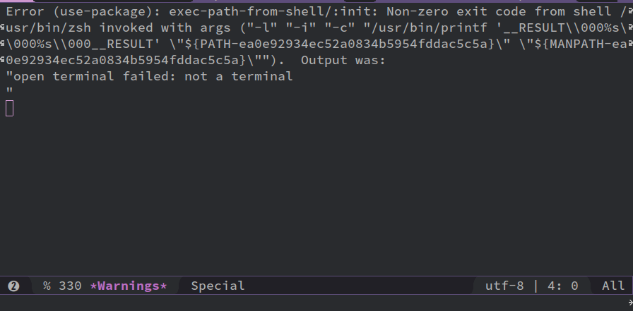

# Error Message

Environment:

-   OS: Ubuntu 18.04
-   Emacs: 25.2.2
-   Shell: Zsh + Tmux



> Error (use-package): exec-path-from-shell/:init: Non-zero exit code from shell zsh invoked with args ("-l" "-i" "-c" "/usr/bin/printf '\_\_RESULT\\\\000%s\\\\000%s\\\\000\_\_RESULT' \\"\({PATH-87922f8a678e8c83b4bbdc20816cbc3c}\" \"\){MANPATH-87922f8a678e8c83b4bbdc20816cbc3c}\\""). Output was: "open terminal failed: not a terminal

Note: the hex string varies each time.

# Possible Reasons

-   PATH edited
-   Incompatible packages
-   `.zshrc` configuration problem
-   Tmux is not compatible with Spacemacs packages. -> I believe this is the actual reason in my case.

# Solution

-   [Reddit/r/spacemacs thread](https://www.reddit.com/r/spacemacs/comments/7c5uta/new_to_spacemacs_but_not_emacs_couple_of_questions/)
-   [Spacemacs FAQ](http://spacemacs.org/doc/FAQ.html#why-am-i-getting-a-message-about-environment-variables-on-startup)
-   [Github spacemacs/issues/4755](https://github.com/syl20bnr/spacemacs/issues/4755#issuecomment-292760094)

## Attempt 1: Change the Shell to Bash

In Spacemacs dotfile (open with `SPC f e d`), add the following lines to the `dotspacemacs/user-init`.

```lisp
(defun dotspacemacs/user-init ()
  (setq explicit-shell-file-name "/bin/bash")
  (setq shell-file-name "bash")
)
```

This solution **works**.

However, the opened shell with `M-x shell` is `bash`, not `zsh`. It is OK for me anyway. If you try to run `zsh` in the shell in Spacemacs, it outputs the following error:

> open terminal failed: terminal does not support clear

## Attempt 2: Disable Shell Checking on Startup

Add the following line to the `dotspacemacs/user-init`

```lisp
(defun dotspacemacs/user-init ()
  (setq exec-path-from-shell-check-startup-files nil)
)
```

This attempt **does not work** (at least for me).

## Attempt 3: Add `exec-path-from-shell` to the `dotspacemacs-excluded-packages` List

```lisp
;; A list of packages that will not be installed and loaded.
dotspacemacs-excluded-packages '(exec-path-from-shell)
```

This attempt **works**.

However, you need to set the variable `exec-path` by yourself, otherwise, when you run `M-x shell`, the new buffer will output the following error and fail to start the shell.

> open terminal failed: terminal does not support clear
> 
> Process shell exited abnormally with code 1

# In Summary

The Attempt 1 is the best solution so far. However, if one would like to run `zsh` in Spacemacs, he/she might want to prevent `Tmux` from starting in Emacs.

Another option is to run `eshell` in Spacemacs. Good luck!
