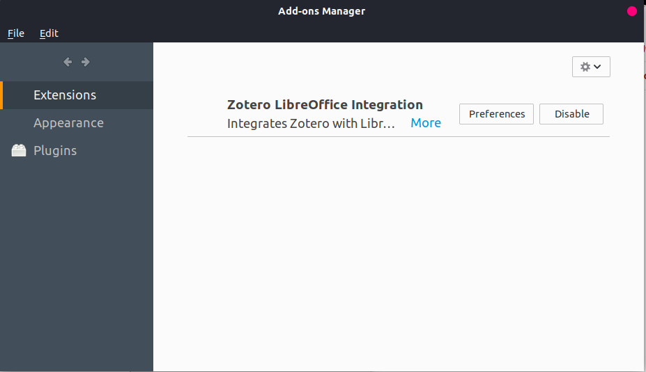
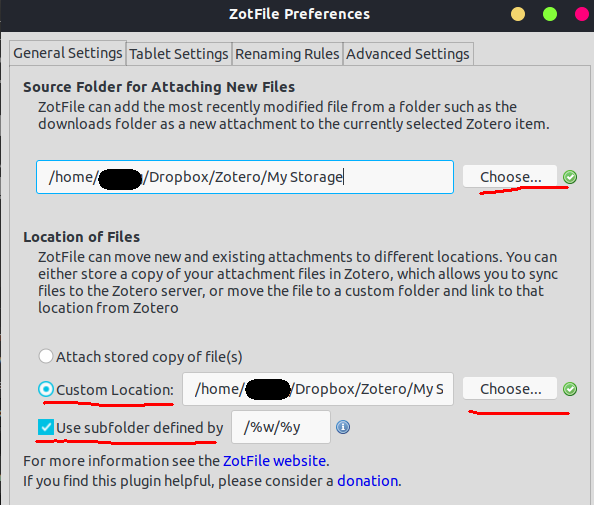
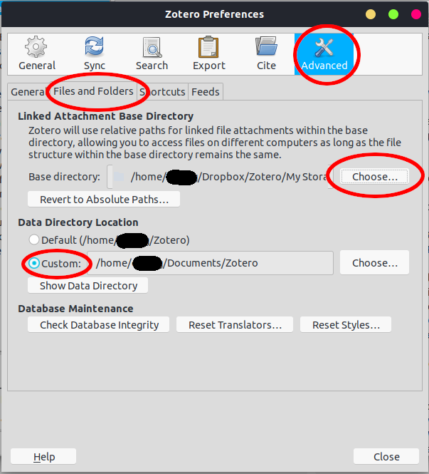
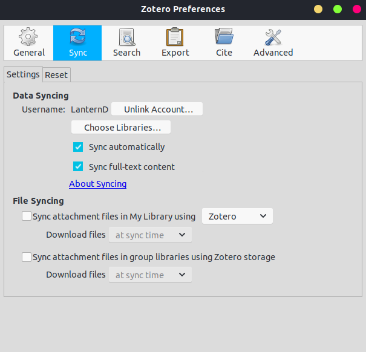
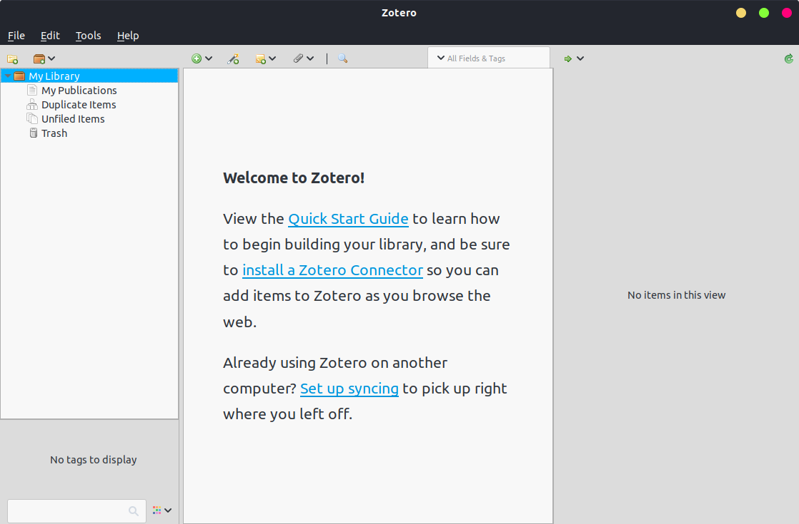
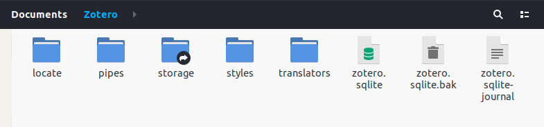

# Goal

Zotero is a well-known free document organization software. It is powerful and easy to use. This post proposes some method to augments its ability to share documents between multiple computers.

The goal is like this: in computer A, I save a PDF document from an online archive database, such as ACM Digital Library, IEEE Xplore, ArXiv, via the Google Chrome Zotero Connector extension. Then:

-   The item appears in the Zotero library, with a linked attachment.
-   The link points to a file location on the disk.
-   The actual PDF documents are synchronized via Dropbox among multiple computers.
-   The Zotero database is synchronized via your personal Zotero profile.

In this way, the documents appears in another computer immediately, safe and sound.

# Prerequisite

-   [Zotero software](https://www.zotero.org/download/){:target="\_blank"}
-   [Zotero Connector](https://chrome.google.com/webstore/detail/ekhagklcjbdpajgpjgmbionohlpdbjgc){:target="\_blank"} (Google Chrome Extension)
-   [ZotFile](http://zotfile.com/){:target="\_blank"} (A Zotero plugin)
-   Dropbox, with sufficient storage space (Google Drive may do the work as well, but I prefer Dropbox on Linux)

# Step 1: Installation

-   Zotero: [installation instructions](https://www.zotero.org/support/installation){:target="\_blank"}
-   ZotFile:
    
    
    
    In `Tools` -> `Add-ons`, click the top-right icon and choose "Install Add-on From File&#x2026;", find the "zotfile-5.0.x-fx.xpi" and install.

# Step 3: General Settings

Enter `Edit` -> `Preferences`.

In `General` tab, uncheck the option "Automatically take snapshots when creating items from web pages". If it is enabled, Zotero generates plenty of trashy files and pollutes your storage folder.

# Step 4: Storage Selection

In `Tools` -> `ZotFile Preferences`, choose the "Source Folder for Attaching New Files".

Next, choose "Location of Files", check "Custom Location" radio button. Select a location in the Dropbox. For example, it is "~/Dropbox/Zotero/My Storage/" in my case.

Finally, check "Use subfolder defined by" with field value `/%w/%y`. It's up to you. But I think this makes your storage folder better organized. Otherwise the folder name is a random sequence. `%w` means the publisher; `%y` means the publish year. Visit [zotfile.com](http://zotfile.com/#renaming-rules){:target="\_blank"} for more information.



Update the settings in "Renaming Rules" and "Advanced Settings" tabs as you like.

---

In `Edit` -> `Preferences`, `Advanced` tab, "Files and Folders" subtab, change the "Base directory" under "Linked Attachment Base Directory". This path should be **your Dropbox storage folder**!



[!important] The "Data Directory Location" is where Zotero stores your personal database (typically `locate`, `styles`, `translators`, `pipes` and `zotero.sqlite`). It is not for attachment (PDF) storage. **Don't set it to a Dropbox folder**! If you would like to change it, backup your personal data first. It will be fine if you leave it as it is. Anyway, your personal database has a copy on Zotero server. This folder is where they synchronize it to local.

Remember your data directory. Let me call it `{your_data_directory}`. We will use it later.

# Step 5: Sign-in and Sync Settings

In `Sync`, sign in the account. Uncheck the two options in "File Syncing".



After that, start to synchronize everything by clicking the button on the top-right corner.



For my 1500+ items, it takes 3 minutes to synchronize the files, and 5 minutes to index the attachments.

# Step 5: Folder Link

If your Zotero finds all the linked attachments, then you are good to go. Otherwise, you need to revise your data directory.

This is the **key step**! You need to replace the `storage` folder under your data directory. The storage folder is the one that actually consumes your storage quota of your Zotero account. If you create a soft link (don't use hard link) and point to the Dropbox folder, you use 0 MB of the storage quota (300 MB for a free account). Both Zotero and you are happy with it.

```sh
ln -s ~/Dropbox/Zotero/My\ Storage {your_data_directory}/storage
```

Note that the folder can only be named "storage", and do not put a pair of double quotes on the folder path.

Finally, the folder looks like this:



By this far, we achieved our [goal](./#goal). You need to do so on every computer that is going to synchronize the Zotero database and attached files.

# Step 6: Other settings (Optional)

This is my preferred setting: the parent collection will contain all the items in its child collections. The Zotero developer called it "Recursive Collection". You can find the way to set it in:

[Zotero Support - Collections and Tags](https://www.zotero.org/support/collections_and_tags#recursive_collections){:target=”\_blank”}

Basically, you set the variable `extensions.zotero.recursiveCollections` to `true` in `Zotero Preferences` -> `Advanced` -> `General` -> `Advanced Configuration` -> `Config Editor`.
