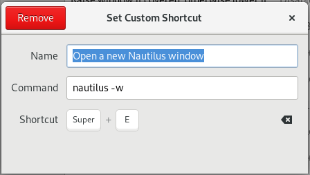
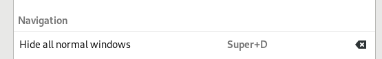

# A Few Words

I encounter problem every now and then on Ubuntu. I decide to take some notes on what I get when searching through websites like [StackOverflow](https://stackoverflow.com).

Last update: 2019-04-05.

# Tips

## Command about listing

-   `ls`: list files and directory.
-   `lsusb`: list USB devices.
-   `lscpu`: list CPU info.
-   `lspci`: list PCI devices.
-   `dmesg`: list display and driver messages.
-   `sudo ss -lntup`: list all the ports that the computer is using or listening.

## How to add a `.desktop` executable file to start menu and "favorites"?

`.desktop` file usually comes with the software packages in `.tar.bz` format, for example, Zotero. When you double click to execute the `zotero.desktop`, you can not add it to the side bar (favorites). The solution is:

```sh
ln -s ~/Software/Zotero_linux-x86_64/zotero.desktop ~/.local/share/applications
```

I just use Zotero to illustrate, other software is likewise. After the symbol exists, you can find it in start menu by press the super (win) key. Open Zotero, and now you can add it to the side bar by right clicking the icon.

2019.03.14 Update: [GUI desktop entry editor](https://askubuntu.com/questions/854373/how-to-create-a-desktop-shortcut/854398).

## Change file owner and user group

Suppose the file name is "so\_happy.org"

```sh
sudo chown user:group so_happy.org
```

The `userhao` and `group` are the ones you want to set.

## Change file permission

Allow file execution:

```sh
sudo chmod +x your_file
```

Set read/write/execute

```sh
sudo chmod 755 your_file
```

There are three bits to represent readable/writable/executable. Then 000 - 111 are mapped to 0-7 decimal digits.

The three digits in the command are owner, group, others.

Read more: [AskUbuntu](https://askubuntu.com/q/932713).

## Hold back a package in `apt upgrade`

[Link](https://askubuntu.com/questions/99774/exclude-packages-from-apt-get-upgrade).

```sh
sudo apt-mark hold <package>
```

[] TODO How to ignore packages in Ubuntu Software Updater?

## Change user password

```sh
sudo passwd your_user_name
```

Type the old password first, then the new one.

## Switch between root and normal users

```sh
sudo -i  # switch to root (temporarily)
su your_user_name  # switch to some user.
```

## Change End-of-Line (EOL) of a file

[Link](https://askubuntu.com/questions/803162/how-to-change-windows-line-ending-to-unix-version).

Install `dos2unix`.

```sh
sudo apt install dos2unix
```

Process file with it.

```sh
dos2unix input_file.txt output_file.txt
```

This is especially helpful for the file `~/.aspell_pws/.aspell.en.pws`. Once Spacemacs is run on Windows, the EOL will be changed to DOS (I synchronize this file with Dropbox).

## Use shortcut to open the file explorer (Nautilus)

Link: [Setting a key shortcut to run an application in GNOME - Fedora Docs](https://docs.fedoraproject.org/en-US/quick-docs/proc_setting-key-shortcut/)

Open `System Settings` -> `Devices` -> `Keyboard`. Scroll to the end. Add a new shortcut. The command to open new folder window is `nautilus -w`. I bind it to `Super+E`, same as Windows.



Btw, I also change the "Hide all normal window" shortcut to `Super+D` (also, same as Windows).



## Taking area screenshot with shortcut

Link: [How to change the keyboard shortcut to take screenshots with Shutter? - StackOverflow](https://askubuntu.com/questions/456985/how-to-change-the-keyboard-shortcut-to-take-screenshots-with-shutter).

1.  Install [shutter](http://shutter-project.org/downloads/) (Available in Ubuntu Software Center).
2.  Go to `System Settings` -> `Devices` -> `Keyboard` (same as above).
3.  Scroll down to the bottom, add a personal shortcut (`Ctrl` + `Shift` + `Alt` + `Z` for me).
4.  Give it a name, whatever. The command is `shutter -s`.
5.  If you want to take a full screenshot, change the command to `shutter -f`, or simply press the `PrintScreen` key.

## Convert GBK-encoded files to UTF-8 encoding

Link: [Linux下GBK->UTF-8文件编码批量转换命令](https://blog.csdn.net/a280606790/article/details/8504133).

1.  Install `enca` by `apt`: `sudo apt install enca`.
2.  Check the usage via `man enca`.
3.  In our case, run the command in terminal:

```sh
enca -L zh_CN file  # check the encoding of the file
enca -L zh_CN -x UTF-8 file  # convert GBK to UTF-8
enca -L zh_CN -x UTF-8 file1 file2  # convert file1 to UTF-8 and save to file2
```

Note: it supports wild card matching, like `*.tex`.

## Using USB pass-through to Oracle VirtualBox

Link: [How to set up USB for Virtualbox?](https://askubuntu.com/questions/25596/how-to-set-up-usb-for-virtualbox)

-   Install "VirtualBox Extension Pack".
-   `sudo usermod -aG vboxusers <username>`
-   Reboot the host computer. Done!

## Minimize the window when clicking the dock icon

Link: [Click on Icon to Minimize Application Window in Ubuntu 18.04](http://tipsonubuntu.com/2018/04/15/click-icon-minimize-application-window-ubuntu-18-04/)

Open terminal, type in the following command and press <Enter>.

```sh
gsettings set org.gnome.shell.extensions.dash-to-dock click-action 'minimize'
```

Done.

## Check gnome version

```sh
gnome-shell --version
```
