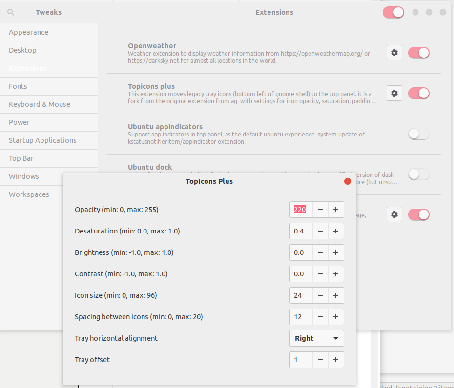

The original post link: [在 Ubuntu18.04 系统顶栏不显示坚果云图标的解决办法 - 故国有明](https://ywnz.com/linuxjc/3171.html)

# Problem

I primarily use Jianguoyun to synchronize files with collaborators in China, since Dropbox is banned by China GFW.

There is no icon shown in the tray on the top of the screen after I run the [Jianguoyun](https://www.jianguoyun.com/) (also known as Nutstore) cloud drive. So you get trouble when you want to change the settings.

# Reason

The latest Gnome discards the old version system tray. However, Jianguoyun still uses the old version. We need another extension to add the old system tray icons.

# Solution

-   Install `gnome-tweak-tool`. I believe the majority of the users have it.
-   Install `TopIcons Plus` extension for Gnome. Once it is installed, the Jianguoyun icon pops up immediately (as the top image shows).
-   Update settings in `Gnome Tweaks`.



# Notice

If Jianguoyun updates their linux app in the future, this post will not work. I may update the post at that time.

# 2019.03.09 Update

I installed Fedora 29 Workstation recently. I could not find the Jianguoyun icon after I tried the above-mentioned solution. The new solution is to login to the `Gnome Xorg` at the user login stage. Also, make sure all the dependencies are met. Double check:

```sh
sudo yum install glib2-devel gtk2-devel nautilus-devel gvfs libappindicator-gtk3  python2-gobject
```
