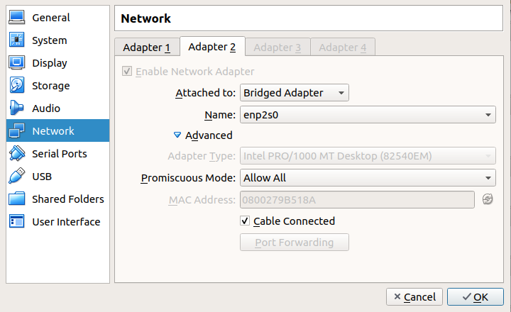
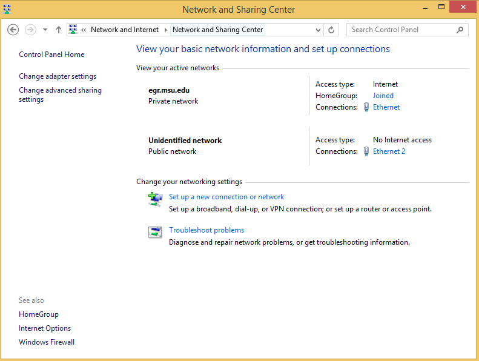
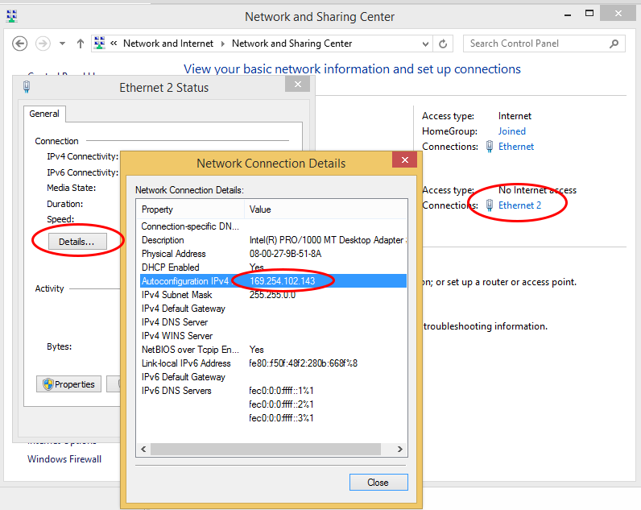
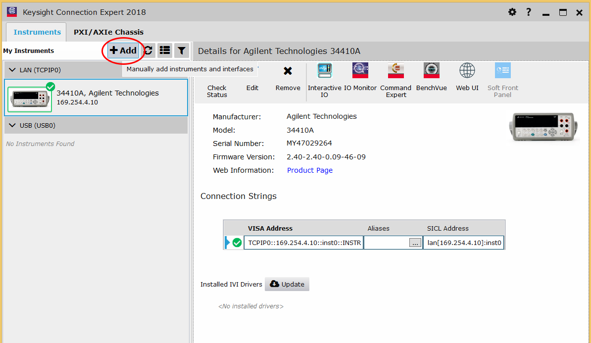

I have a digital multimeter (DMM) at hand (Agilent 34410A) and I found that it has data output through "Remote I/O" option. However, my workstation is Ubuntu. I did some Googles and found that only Windows PC supports the connection to an Agilent/Keysight device. So I tried the following efforts and made the DMM connect to the PC. Not much information about this process is available so I write a post to take a note.

# Step 1 - Install VirtualBox

There are many virtual machine host software suites available. I choose the most commonly-used one: [Oracle VM VirtualBox](https://www.virtualbox.org/wiki/Downloads). Download both:

-   VirtualBox platform packages
-   VirtualBox Oracle VM VirtualBox Extension Pack

The "Guest Additions" add-on may also be helpful. Install it via `sudo apt install virtualbox-guest-x11`.

# Step 2 - Install Windows

My Windows version is 8.1. Only Windows 7/8.1/10/Server are supported by the Keysight IO Libraries Suite.

# Step 3 - Install Keysight IO Libraries Suites

Download at: [Keysight Instrument Control Bundle Download](https://www.keysight.com/main/software.jspx?cc=US&lc=eng&ckey=1184883&nid=-33002.977662&id=1184883).

This bundle includes:

-   IO Libraries Suite
-   Command Export
-   BenchVue Platform

The downloaded package is about 1.1 GB. You can install them one by one. The key one is the IO Libraries Suite. Multiple reboots are required to finish the installation.

# Step 4 - Hardware connection

Use the ethernet cable to connect the PC NIC (Network Interface Card) and the LAN port on the rear panel of the Agilent 34410A. You can try USB connection as well.

# Step 5 - VirtualBox settings

Change the settings in "Network" tab.

Specifically, enable "Adapter 2" (Adapter 1 is for regular network connection of the VM guest). Change the "Attached to" to "Bridge Adapter". The "Name" should be the NIC which the LAN cable is connected to. You can use `ifconfig` to check it. For me, it is "enp2s0". I'm not quite sure about the settings under "Advanced", they seems irrelevant.

# Step 6 - Check the settings on Windows VM

There will be one more network connection as shown below.

Click for the detail and check the IP address.

In my case, the IPv4 is "169.254.102.143". However, this is not for the DMM.

# Step 7 - Check the IP address of the DMM

-   On the Agilent 34410A, press "Shift + Data Log" to enter the Utility Menu
-   Next, enter "Remote I/O" -> "LAN" -> Choose "Yes" in "Enable LAN?".
-   Choose "View" in LAN settings. You can find the IP in the "IP\_Address" column.

In my case, the IP is "169.254.4.10". Remember this.

# Step 8 - Find the device

Open "Keysight Connection Expert".

Click add and type in the device IP address. All set!

Now you can use other software to log the data of the DMM.
