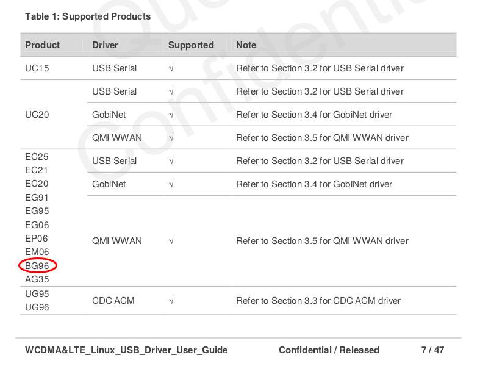
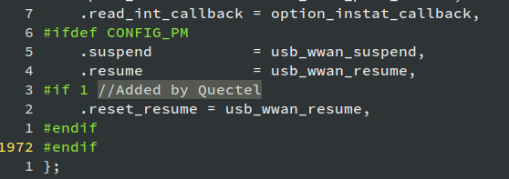
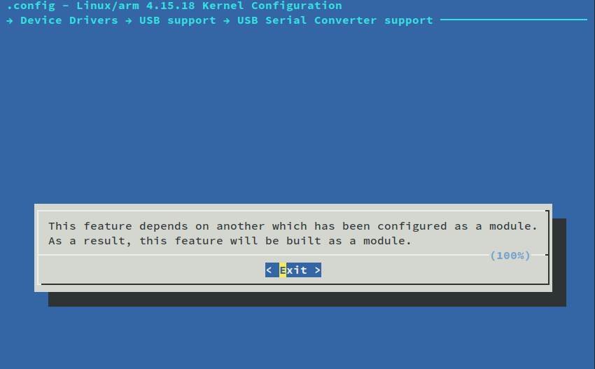
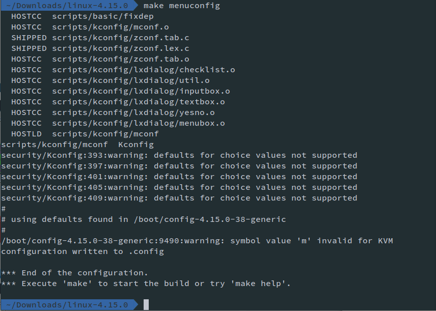
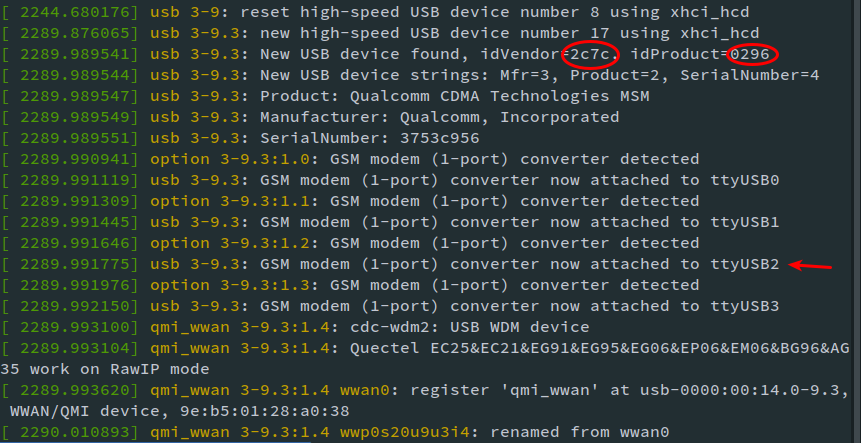
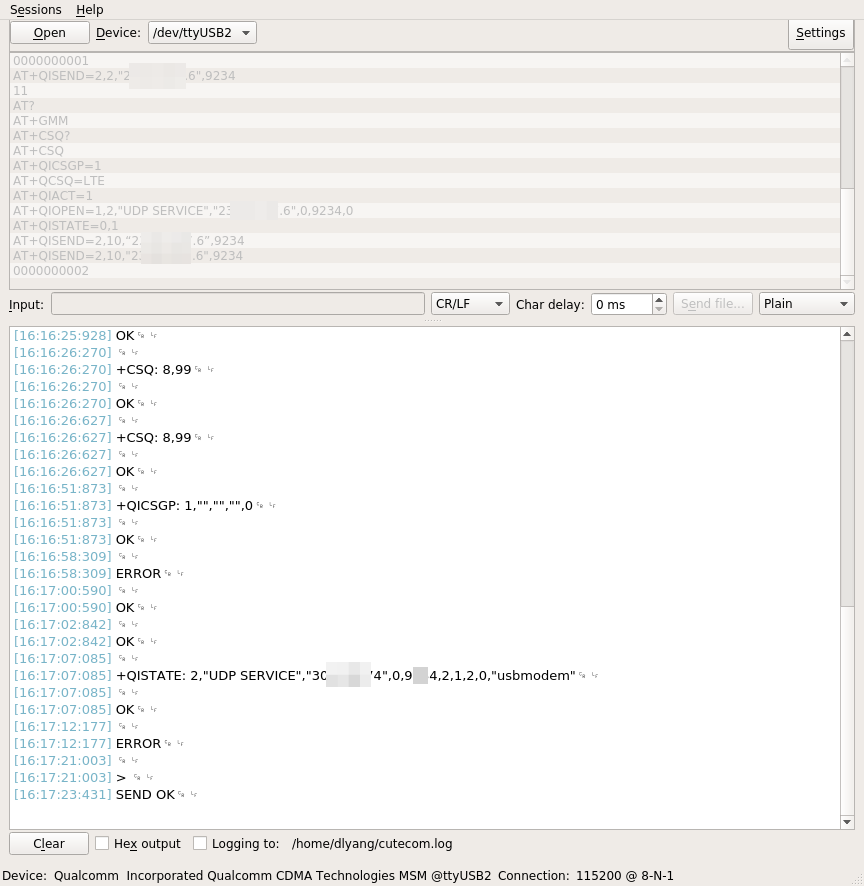

# Important Document

Quectel provides an official document that guides you to configure the QMI WAN driver for the Quectel BG96 board. This post is primarily based on this document. I use "the DOC" to refer to this document.

-   File neme: Quectel\_WCDMA&LTE\_Linux\_USB\_Driver\_User\_Guide\_V1.8.pdf
-   Version: 1.8
-   Update date: 2017-09-01

# Why Do We Need This Driver?

The BG96 module supports AT terminal and debug info output through USB. If you don't have this driver, you need a serial-to-USB converter to communicate with the device on your host PC. You need even one more to access the debug serial port. Things go complicated that way.

So the roadmap is: install the driver; install the Qualcomm software in the Windows VM on Linux; communicate with the device through USB.

I will describe two approaches. After a whole day's debug, I would say that **Approach 2 is better and easier**.

# Approach 1

## Figure out which driver is needed

Page 7 shows a table that indicates which device uses what Linux driver.



So BG96 supports USB serial, GobiNet, and QMI WWAN drivers. Let's go to Section 3.2 directly.

## Get the Source

Find a directory for file downloading.

```sh
apt source linux-source-4.15.0
cd linux-4.15.0/drivers/usb/serial
```

## Edit the `option.c`

```sh
vim option.c
```

We mostly work on Quectel BG96, so you just need to take a look at the line in the DOC section 3.2.1.

Important Notice: the latest Linux kernel (mine: 4.15.0-38), or more specifically, the kernel after Nov 20, 2017, has already added the Quectel BG96 to the `option.c`. So you can **just IGNORE Section 3.2.1 Add VID and PID**. For more detail, check [this post](https://lore.kernel.org/patchwork/patch/853074/) and [this post](https://lore.kernel.org/patchwork/patch/852881/) in the Linux kernel mail list.



Next, follow Section 3.2.2 to 3.2.5, adding "Zero Packet Mechanism", "Reset Resume", "Enlarge Bulk out URBs", "Use GobiNet or QMI WWAN" functions to the `option` driver.

## Compile and Install `option`

Follow the steps in Section 3.2.6 of the DOC. Ignore Step 2 since it is for Raspberry Pi.

Go back to the root folder of the Linux kernel source directory. Run

```sh
make menuconfig
```

Find the corresponding choice and enable it. Use left and right arrow keys to save the config.

Note that the menu of the GUI is different from Figure 2 in the DOC.





Build it. Do not simply run `make`, which means compile the whole kernel. Instead, you just need the driver modules to communicate with the device.

```sh
sudo make -C /lib/modules/`uname -r`/build M=`pwd`/drivers/usb/serial obj-m=option.o modules
sudo make -C /lib/modules/`uname -r`/build M=`pwd`/drivers/usb/serial obj-m=usb_wwan.o
modules
sudo make -C /lib/modules/`uname -r`/build M=`pwd`/drivers/usb/serial obj-m=qcserial.o modules

sudo cp drivers/usb/serial/option.ko /lib/modules/`uname -r`/kernel/drivers/usb/serial
sudo cp drivers/usb/serial/usb_wwan.ko /lib/modules/`uname -r`/kernel/drivers/usb/serial
sudo cp drivers/usb/serial/qcserial.ko /lib/modules/`uname -r`/kernel/drivers/usb/serial
sudo depmod
sudo reboot
```

## GobiNet and QMI WWAN Driver

I don't have an idea about these drivers yet. They seem the "official" Qualcomm drivers for the chipset, while "USB Serial" is something developed by Quectel. If you are interested in them, go ahead and follow the instructions in the DOC.

Note:

-   Read carefully about the kernel version.
-   Insert the code when the function or `struct` really exist! There are sentences like "if follow struct exist, modify it as below".

I will have a picture below showing what's the difference which these drivers.

## Test the Device

### Test through the terminal log

Now here comes the most exciting part.

Plug your BG96 board through to the Linux host. Do not forget shorting the "USB detect" pin of the module.

If the hardware works correctly, BG96 will create 4 instances in the `/dev` directory.

-   /dev/ttyUSB0
-   /dev/ttyUSB1
-   /dev/ttyUSB2
-   /dev/ttyUSB3

Check the output of `dmesg` (display/device message). If it is something like the following image, then it works well.



Note: the `idVensor` should be `2c7c`, which means Quectel, and the `idProduct` should be `0296`, which means BG96.

Specifically, the messages

> [ 2244.680176] usb 3-9: reset high-speed USB device number 8 using xhci\_hcd
> 
> [ 2289.876065] usb 3-9.3: new high-speed USB device number 17 using xhci\_hcd
> 
> [ 2289.989541] usb 3-9.3: New USB device found, idVendor=2c7c, idProduct=0296
> 
> [ 2289.989544] usb 3-9.3: New USB device strings: Mfr=3, Product=2, SerialNumber=4
> 
> [ 2289.989547] usb 3-9.3: Product: Qualcomm CDMA Technologies MSM
> 
> [ 2289.989549] usb 3-9.3: Manufacturer: Qualcomm, Incorporated
> 
> [ 2289.989551] usb 3-9.3: SerialNumber: 3753c956
> 
> [ 2289.990941] option 3-9.3:1.0: GSM modem (1-port) converter detected
> 
> [ 2289.991119] usb 3-9.3: GSM modem (1-port) converter now attached to ttyUSB0
> 
> [ 2289.991309] option 3-9.3:1.1: GSM modem (1-port) converter detected
> 
> [ 2289.991445] usb 3-9.3: GSM modem (1-port) converter now attached to ttyUSB1
> 
> [ 2289.991646] option 3-9.3:1.2: GSM modem (1-port) converter detected
> 
> [ 2289.991775] usb 3-9.3: GSM modem (1-port) converter now attached to ttyUSB2
> 
> [ 2289.991976] option 3-9.3:1.3: GSM modem (1-port) converter detected
> 
> [ 2289.992150] usb 3-9.3: GSM modem (1-port) converter now attached to ttyUSB3

are the output of the USB serial and option driver, while the messages

> [ 2289.993100] qmi\_wwan 3-9.3:1.4: cdc-wdm2: USB WDM device
> 
> [ 2289.993104] qmi\_wwan 3-9.3:1.4: Quectel EC25&EC21&EG91&EG95&EG06&EP06&EM06&BG96&AG35 work on RawIP mode
> 
> [ 2289.993620] qmi\_wwan 3-9.3:1.4 wwan0: register 'qmi\_wwan' at usb-0000:00:14.0-9.3, WWAN/QMI device, 9e:b5:01:28:a0:38
> 
> [ 2290.010893] qmi\_wwan 3-9.3:1.4 wwp0s20u9u3i4: renamed from wwan0

are the output of the QMI WWAN module. If you have GobiNet, there will be other driver messages.

### Test through AT commands

Open CuteCom (if you don't have one, use `sudo apt install cutecom` to get it).

Connect to `/dev/ttyUSB2` with 115200 baudrate. If the AT commands work well, then the driver is functioning properly.



### Possible bugs

During the building process, I encountered an error as shown below:

> [ 109.303961] usb 3-2: new full-speed USB device number 9 using xhci\_hcd
> 
> [ 109.431998] usb 3-2: device descriptor read/64, error -71
> 
> [ 109.667972] usb 3-2: device descriptor read/64, error -71
> 
> [ 109.904004] usb 3-2: new full-speed USB device number 10 using xhci\_hcd
> 
> [ 110.031974] usb 3-2: device descriptor read/64, error -71
> 
> [ 110.267970] usb 3-2: device descriptor read/64, error -71
> 
> [ 110.376009] usb usb3-port2: attempt power cycle
> 
> [ 111.027997] usb 3-2: new full-speed USB device number 11 using xhci\_hcd
> 
> [ 111.028121] usb 3-2: Device not responding to setup address.
> 
> [ 111.236115] usb 3-2: Device not responding to setup address.
> 
> [ 111.443973] usb 3-2: device not accepting address 11, error -71
> 
> [ 111.571952] usb 3-2: new full-speed USB device number 12 using xhci\_hcd
> 
> [ 111.572073] usb 3-2: Device not responding to setup address.
> 
> [ 111.780084] usb 3-2: Device not responding to setup address.
> 
> [ 111.987980] usb 3-2: device not accepting address 12, error -71
> 
> [ 111.988012] usb usb3-port2: unable to enumerate USB device

It means the host found the device, but failed to connect to the device.

The reason was that the connection of the USB port was not good. I replaced the PCB and the problem is solved.

# Approach 2

Approach 1 is cumbersome. Then I found an easier way to do.

```sh
sudo -E vim /etc/modules
```

Add the following lines:

> qmi\_wwan
> 
> qcserial
> 
> option

Save it. In other words, we are loading the default module configurations of the Quectel BG96 supports from the Linux kernel.

Reboot, and the device is ready to use.

Of cause, the cost is that you may encounter potential problems if the kernel code is not updated as specified by Quectel. Anyway, the AT commands work well in this way and that's what I need.

Hope the two approaches can help you.
