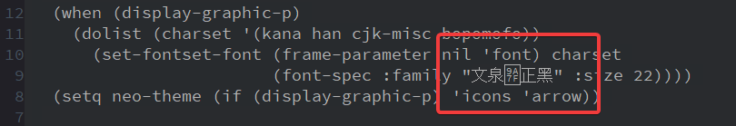
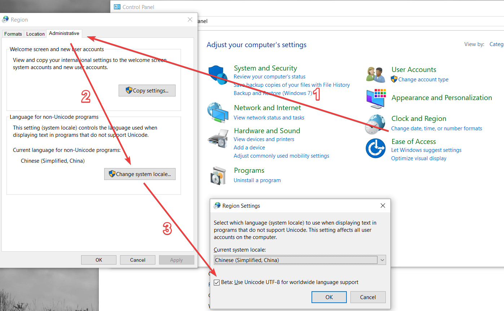
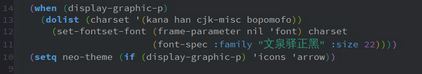

# Problem

The problem is like this: the system fails in displaying some of the Chinese characters. If you check the `Messages` buffer, the error is: "Invalid coding system: cp65001" or "file mode specification error: coding-system-error cp65001".

# Solution

I found the solution on Reddit: [Invalid coding system: cp65001](https://www.reddit.com/r/emacs/comments/98qq5k/invalid_coding_system_cp65001/).

Basically the solution is to disable the "BETA: Use Unicode UTF-8 for worldwide language support".

Remember to reboot the computer.

# After Fixing

Here is what it looks like after the bug is fixed.

Done
