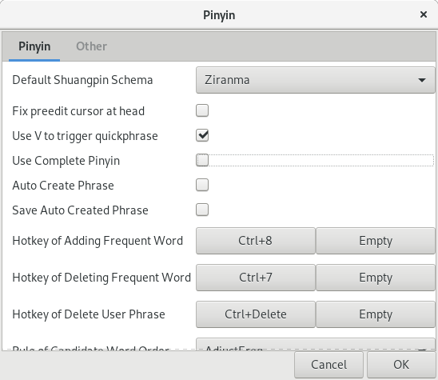
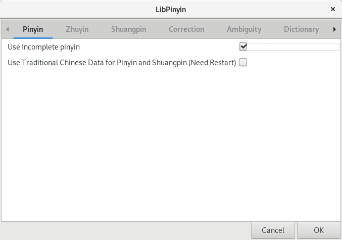
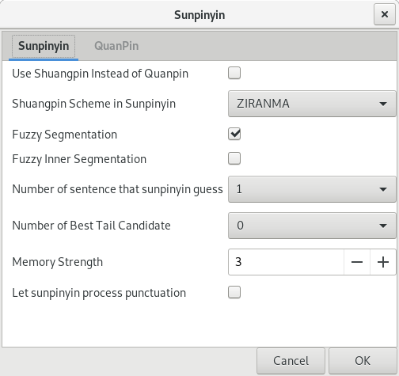

`fcitx` is a famous input method framework for Linux. Many languages use `fcitx` as the input methods backend. In my case, I use Pinyin input methods. There are three Pinyin input methods installed on my Fedora machine.

-   `Pinyin`
-   `sunpinyin`
-   `LibPinyin`

Today I accidentally changed the configuration of the `fcitx`, actually a bunch of settings all at once. After that I could not get the correct character candidates if I typed an acronym for a specific phase. I was to post an image of this case. But the screenshot failed to capture it (conflict with `fcitx`). I intended to type "cf" for "chifan", but not a single Chinese character came out.

I double checked. This only happened to `Pinyin` and `LibPinyin`, while `sunpinyin` works normally.

After debugging one by one, I identified the cause.

Just confirm that you choose "enable incomplete" Pinyin mode.

-   In `Pinyin`, **do not check** "Use Complete Pinyin".
-   In `LibPinyin`, **do check** "Use Incomplete pinyin".

That's it.

Configuration of `Pinyin`:

Configuration of `LibPinyin`:

Configuration of `sunpinyin` (You don't have this option here):

