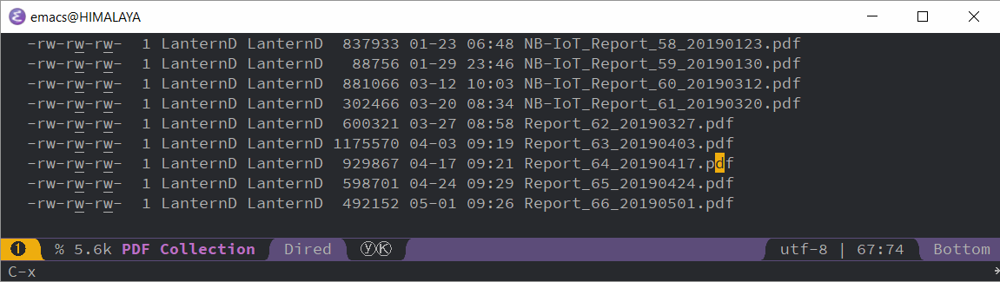

Here is a link about how it work: [Emacs Dired rename many files](https://stackoverflow.com/questions/15881776/emacs-dired-rename-many-files).

Basically the steps are:

1.  Open dired mode, use <kbd>SPC</kbd> <kbd>f</kbd> <kbd>j</kbd> or <kbd>SPC</kbd> <kbd>f</kbd> <kbd>f</kbd>.
2.  Press <kbd>C-x</kbd> <kbd>C-q</kbd> to enter editable dired mode. Now it is like a normal text buffer.
3.  Change the name to whatever you like.
4.  Press <kbd>C-x</kbd> <kbd>C-s</kbd> or <kbd>C-c</kbd> <kbd>C-c</kbd> to save the edit. Now the file names are updated.
5.  (If you want to discard changes, press <kbd>C-c</kbd> <kbd>C-k</kbd>.)

Note: <kbd>C-c</kbd> means <kbd>CTRL+c</kbd>. <kbd>SPC</kbd> means space key (the leader key).

Here is a screen GIF (recorded by ScreenToGif, 728 kB).

I didn't figure out a way to batch paste the text in the buffer yet. If I found it I will update this post. Also, square edit somewhat does not work in `editable dired mode`.

More advanced topic: [Batch rename files to numeric sequence in dired?](https://emacs.stackexchange.com/questions/27492/batch-rename-files-to-numeric-sequence-in-dired)
