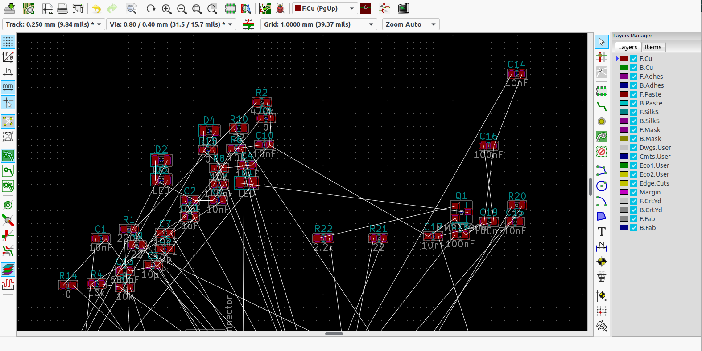
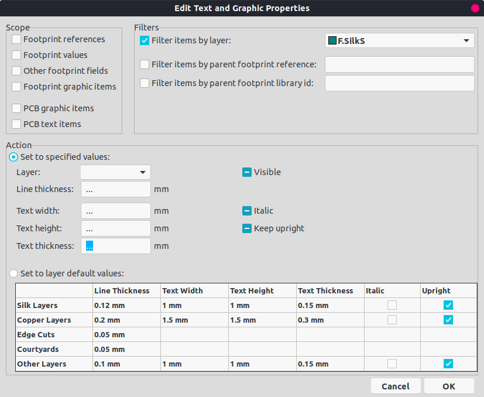
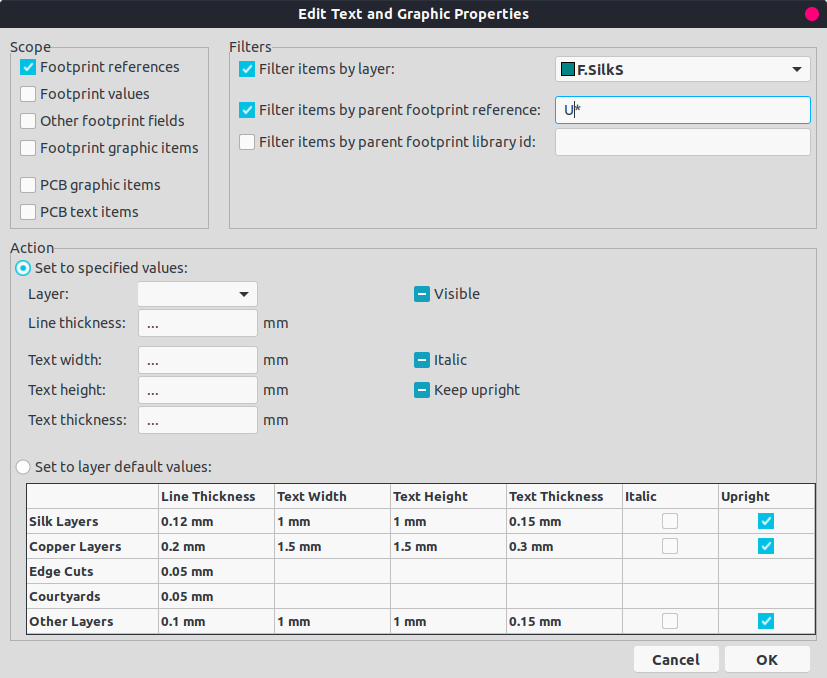
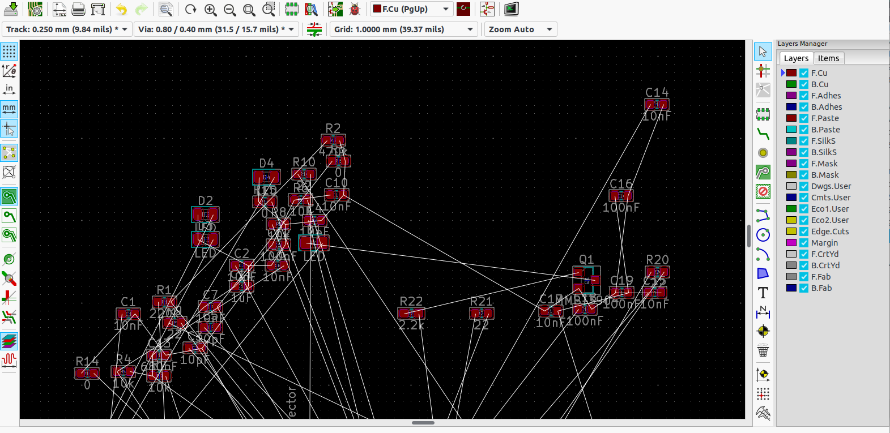

# A Link

Here is a link in the KiCad forum, discussing how to globally edit the text in the PCB.

<https://forum.kicad.info/t/globally-edit-reference-designator-text/488>

Then I managed to change all the footprint reference to invisible, rendering the PCB looks clean and elegant.

# Walk Through

Before changing, the reference symbol looks like:

Step 1. Open 'Edit' -> 'Edit Text & Graphic Properties&#x2026;'

Step 2. Select 'Footprint references' on the top left panel; check the filter as 'F.silks'; Specify the footprint you want to change in 'Filter items by parent footprint reference', e.g. 'R\*', 'C\*'.

Step 3. [The most important one] **Uncheck the 'Visible'** in the 'Action' panel.

Step 4. Done. Here is how it looks after editing:

# End

By the way, my KiCad version is 5.99.0 (Nightly build, installed in Aug 2019.
