# Head Notes

This post is for Mac OS and Linux. I haven't tested it on Windows, but there should be solutions for Windows as well.

# Basic Questions

Ignore these questions if you are already familiar with them.

-   What is code completion?
    
    It's a basic function that a qualified IDE should have. It lists a bunch of candidates for completion based on what you type. See the photo below.
    
    Without code completion:
    
    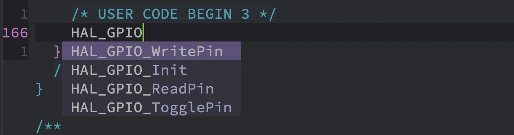
    
    With code completion:
    
    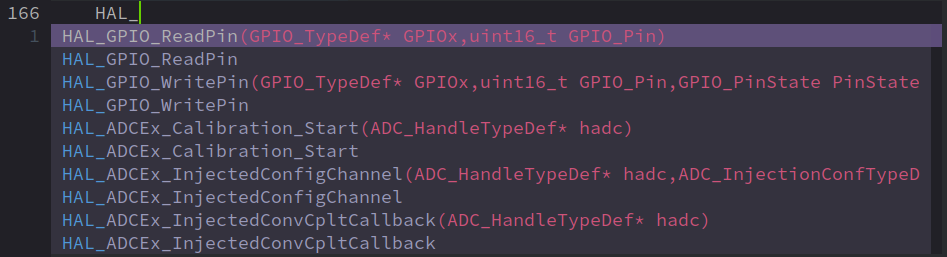
    
    With code completion, the candidates will be marked by its source (Reference in this case). Otherwise, the default completion engine will just show you whatever variables available in the opened buffers.
    
    After you confirm the completion, it will prompt you the arguments to be enter to the function. Also, the candidates are sorted by frequency of adoption, so it kinda looks "smart".

-   What is Spacemacs?
    
    A wonderful 'text editor' that has almost all the features you need for programming. Also, it is a one-fit-all solution. You can code Python, C/C++, HTML, Ruby, Javascript, etc. in it, instead of open different IDEs to do so. VS Code can achieve this as well, but Spacemacs is more hackable, allowing for much more customization.
    
    Check [spacemacs.org](https://www.spacemacs.org) for more info.

-   What is `clang`?
    
    `clang` is a compiler frontend, using `llvm` (originally short for 'Low-Level Virtual Machine) as the compiler backend for C, C++, Objective-C, and Objective-C++.
    
    You can consider `clang` + `llvm` = a better `gcc` compiler (Note: I cannot make sure 100% correctness of this statement). It's said that `clang` and `llvm` run faster and are more powerful.

-   What is tag-based code completer?
    
    This approach adds tags to (almost) all the elements in your code, such as method names, class names, macro definitions, variables, constants, etc., such that a completion database could be built, and their dependencies are captured.
    
    It is said that tag-based backend will be faster and require less memory.
    
    Common tag-based systems:
    
    -   `ctags`
    -   `gtags`
    -   `rtags`

-   What is LSP-based code completer?
    
    LSP is short for "[language server protocol](https://en.wikipedia.org/wiki/Language_Server_Protocol)". LSP, based on JSON-PRC, is a somewhat modern approach for code editor augmentation. It runs as a server/service, and listens to the operation at the client side (namely the code editor) and returns the possible actions at this moment. I guess it may build a semantics-based database and resolves the dependencies as well, but more dynamically than the tag-based approaches.
    
    LSP unifies the development environment for the majority of the programming language. In the past, different IDEs/editors implement their completion/refactor/cross-reference systems. As you may know, this is inefficient and the quality is not well-controlled. The debut of LSP largely solved this problem. The completion backend developers now can focus on how to make their completion server better, without taking care of how the editor/IDE (client) and the server communicates.
    
    As for my personal experience, LSP-based code completion is easier to configure and maintain than the tag-based approach. But it is said that LSP-based backend will consume more memory.

-   What makes embedded C/C++ different?
    
    What I write in this post is just a subset of standard C/C++ development on a PC. Embedded systems use C/C++ as well but there are some differences.
    
    -   Cross-compilation. Embedded system code needs cross-compilation. In other words, the executable is compiled on PC but is downloaded to MCU to run. The standard C/C++ project is usually compiled and run on the same machine.
    
    -   For STM32, ARM provides a compiler tool called `arm-none-eabi-gcc`. It is a modification of `gcc`. So as you may have guessed, the "standard library" for STM32 is different from x86/AMD64 machines.
    
    -   The code structure is simpler. The embedded system has a much smaller RAM and Flash to host the code. In other words, the code size should be smaller than the standard C/C++ development.
    
    -   No need for the advanced modules for higher version C/C++. Higher version of `clang` supports them, but STM32 coding doesn't need them.

# Prerequisites

## `clang` and `llvm`

As said above, you don't need an up-to-date version of them (they are at version 9.0.0 at the time of this post). Version 8.0 is more than enough for STM32 coding.

They are usually bundled and referred together, but it seems that they need to be installed separately.

-   Mac OS: `brew install llvm`, `brew link llvm`
-   Ubuntu: `sudo apt install clang-8 clang-format-8 libclang-8-dev libclang-common-8-dev llvm-8 llvm-8-dev`,

People said it is OK to download the [pre-build binaries](http://releases.llvm.org/download.html) and configures the `PATH` variable. You can try that as well.

## `bear`

Official site: [rizsotto/Bear - Github](https://github.com/rizsotto/Bear).

`bear` is useful for general C/C++ development, but I have another walkaround for the STM32 project. You can keep it for future use.

---

# Spacemacs in `master` Branch

On 2019.11.11, the version is 0.200.13@26.2 on my MacBook.

The description of C/C++ layer could be found [here (Github)](https://github.com/syl20bnr/spacemacs/blob/3b0c1fd93db13fd10f9b03d4ba4a8016ebc3a9f7/layers/%2Blang/c-c%2B%2B/README.org).

> To enable Clang support set the layer variable c-c++-enable-clang-support to t in the dotfile:
> 
> ```emacs-lisp
> (setq-default dotspacemacs-configuration-layers
>   '((c-c++ :variables c-c++-enable-clang-support t)))
> ```

`clang` support needs a file called `.clang_complete` to get a list of folder paths that contains the included header files, so that the `clang` can find them and analyze them.

## How to generate `.clang_complete`?

**This is actually the main point of this post**. Because everything above could be found easily on the internet.

### Generic approach (Not for STM32 projects)

Download a file called `cc_args.py` in [clang\_complete](https://github.com/xavierd/clang_complete/blob/master/bin/cc_args.py). Its usage could be found in [a video by Eivind Fonn on YouTube](https://youtu.be/OjbkCEkboA8?t=1696). In brief, `cc_args.py` consumes the commands generated by the `cmake` and outputs them after formatted.

This way is generic, for general C/C++ development. However, you know, you don't use **command line** to build an STM32 or other embedded system projects. You just click the "Build" button on the IDE and everything is done by the IDE (SW4STM32 in my case).

Since I could not find a good way to apply the cc\_args.py to an STM32 project. I gave up this approach.

### For STM32 projects

STM32 depends on the code generator, cubeMX or something else. Therefore, the include paths and compile options are generated automatically. The question is where to find them.

I somehow generated a `.clang_complete` file for my project successfully. Here is what it looks like:

```sh
-I./FATFS/Target
-I./FATFS/App
-I./Core/Inc
-I./Drivers/STM32F1xx_HAL_Driver/Inc
-I./Drivers/STM32F1xx_HAL_Driver/Inc/Legacy
-I./Middlewares/Third_Party/FatFs/src
-I./Middlewares/Third_Party/FatFs/src/drivers
-I./Drivers/CMSIS/Device/ST/STM32F1xx/Include
-I./Drivers/CMSIS/Include
-I./USB_DEVICE/App
-I./USB_DEVICE/Target
-I./Middlewares/ST/STM32_USB_Device_Library/Core/Inc
-I./Middlewares/ST/STM32_USB_Device_Library/Class/CDC/Inc
-DUSE_HAL_DRIVER
-DSTM32F103xE
-D__weak=__attribute__((weak))
-D__packed=__attribute__((__packed__))
-Wall
-Wno-unused-parameter
```

(Note: your project may be different from mine)

Basically it records all the build options and paths during the `make` process. Specifically, the below parts:

```sh
-DUSE_HAL_DRIVER
-DSTM32F103xE
-D__weak=__attribute__((weak))
-D__packed=__attribute__((__packed__))
-Wall
-Wno-unused-parameter
```

could be actually used by all other STM32 projects with just slight modification. The question is how to get the header file paths.

My solution is, there are already available, generated by `CubeMX`. There are three places you can find them.

1.  `.cproject` (not so good)
    
    Under the project root folder of the generated code, open a file called `.cproject`. Search "includePath", and you will see them in the XML fields.
    
    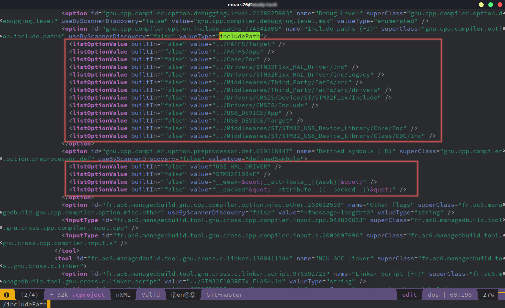

2.  `.mxproject` (better)
    
    Same location as above, a different file called `.mxproject`. Open it and scroll down to the end, the same information is there.
    
    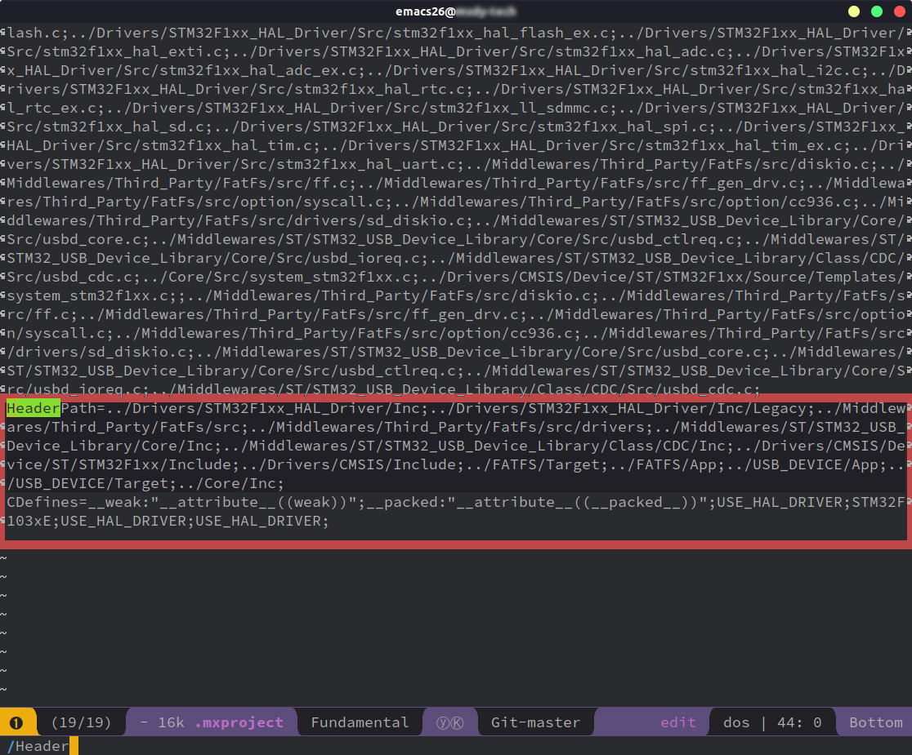
    
    I think This file is easier to format.

3.  IDE setting (recommended)
    
    Here is another way to find all the include paths that are already formatted. On menu bar, open "Project" -> "Properties". Check the below graph for the included paths. Use <kbd>CTRL+A</kbd> and <kbd>CTRL+C</kbd> to get them all.
    
    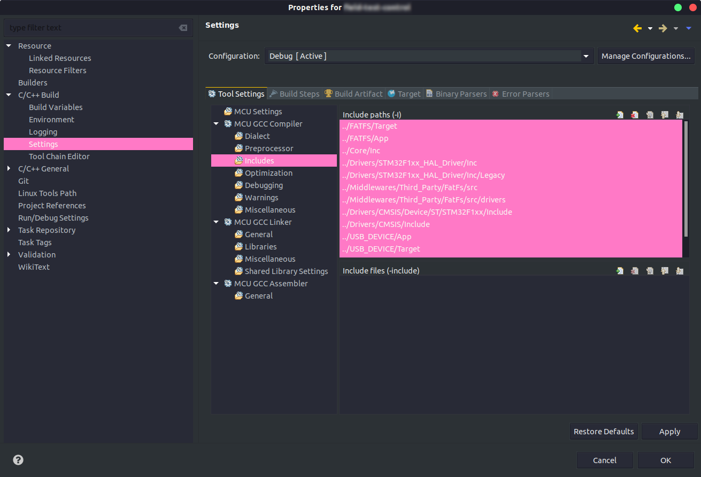
    
    You can also find the defined options for the project in "Preprocessor".

## Get it worked in Spacemacs

If you have finished the following:

-   Get `clang` installed.
-   Prepare a `.clang_complete` file for the STM32 project.
-   Enable `c-c++-enable-clang-support` in the Spacemacs config file.

You should be able to work with an awesome STM32 coding environment.

Done!

---

# Spacemacs in `develop` Branch

On 2019.11.11, the version is 0.300.0@26.3 on my Ubuntu machine.

Since the develop branch will finally become the master branch, it is better to follow this section.

The description of C/C++ layer for the Spacemacs `develop` branch can be found [here (Github)](https://github.com/syl20bnr/spacemacs/blob/73c2141fabe8283f3ec44f3271dc6e08734a0ee0/layers/+lang/c-c++/README.org).

In the new version, they introduce the concept of "backend". Now we have several options, namely, `lsp-clangd`, `lsp-ccls`, `lsp-cquery`, `rtags`, `ycmd`.

I tried `rtags` without luck, and I switch to `lsp-ccls` and it works great so far. I documented both of them here.

## Tag-based completion

### Install `rtags`

Official site:[Andersbakken/rtags - Github](https://github.com/Andersbakken/rtags).

Check the "TLDR Quickstart":

> ```sh
> git clone --recursive https://github.com/Andersbakken/rtags.git
> cd rtags
> cmake -DCMAKE_EXPORT_COMPILE_COMMANDS=1 .
> make
> sudo make install
> ```

Check the usage: [Wiki/Usage](https://github.com/Andersbakken/rtags/wiki/Usage).

`rtags` needs a file called `compile_commands.json` to work.

Note: read more about this file [here](https://clang.llvm.org/docs/JSONCompilationDatabase.html).

### How to generate `compile_commands.json`?

The `rtags` usage wiki page introduces several ways. The standard method is using `cmake` with `-DCMAKE_EXPORT_COMPILE_COMMANDS=1` option. But you know, STM32 doesn't have `cmake` support.

I used the `bear` I mentioned in "Prerequisites" above. The usage can be found on its website.

Here is what I had done for the STM32 project:

1.  Compile your project for once in the SW4STM32 IDE.
2.  Go to the `Debug` folder, clean all the `*.o` and `*.d` files by `rm ./**/*.o` and `rm ./**/*.d` (or read [this post](https://askubuntu.com/questions/377438/how-can-i-recursively-delete-all-files-of-a-specific-extension-in-the-current-di)).
3.  Run `bear make`

However, the `compile_commands.json` file looks nasty and bulky, and it seems not to include the "command" field as the file I found online.

Here is how one of the items looks like:

```json
{
  "arguments": [
      "cc",
      "-c",
      "-mcpu=cortex-m3",
      "-mthumb",
      "-mfloat-abi=soft",
      "-DUSE_HAL_DRIVER",
      "-DSTM32F103xE",
      "-D__weak=__attribute__((weak))",
      "-D__packed=\"__attribute__((__packed__))\"",
      "-I/some_path/FATFS/Target",
      "-I/some_path/FATFS/App",
      "-I/some_path/Core/Inc",
      "-I/some_path/Drivers/STM32F1xx_HAL_Driver/Inc",
      "-I/some_path/Drivers/STM32F1xx_HAL_Driver/Inc/Legacy",
      "-I/some_path/Middlewares/Third_Party/FatFs/src",
      "-I/some_path/Middlewares/Third_Party/FatFs/src/drivers",
      "-I/some_path/Drivers/CMSIS/Device/ST/STM32F1xx/Include",
      "-I/some_path/Drivers/CMSIS/Include",
      "-I/some_path/USB_DEVICE/App",
      "-I/some_path/USB_DEVICE/Target",
      "-I/some_path/Middlewares/ST/STM32_USB_Device_Library/Core/Inc",
      "-I/some_path/Middlewares/ST/STM32_USB_Device_Library/Class/CDC/Inc",
      "-Og",
      "-g3",
      "-Wall",
      "-fmessage-length=0",
      "-ffunction-sections",
      "-fmessage-length=0",
      "-MFMiddlewares/Third_Party/FatFs/src/option/syscall.d",
      "-MTMiddlewares/Third_Party/FatFs/src/option/syscall.o",
      "-o",
      "Middlewares/Third_Party/FatFs/src/option/syscall.o",
      "../Middlewares/Third_Party/FatFs/src/option/syscall.c"
  ],
  "directory": "/some_path/Debug",
  "file": "../Middlewares/Third_Party/FatFs/src/option/syscall.c"
},
```

Imagine you have hundreds of such very similar items, resulting in a file with 130 kB. This solution is just not elegant.

But the most important part is that I ran the `rdm` server and `rc -J compile_commands.json` file, **The completion options didn't come up at all**.

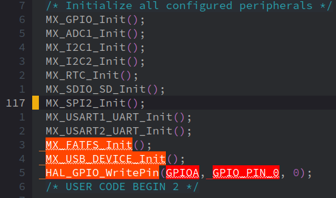

I didn't want to spend any more time on debugging this and I switched to LSP.

Should anyone know how to get `rtags` work, please let me know? Thanks.

## LSP-based completion

As you may had read from the C/C++ layers description, there are three LSP backends available for C/C++ mode: `lsp-clangd`, `lsp-ccls`, and `lsp-cquery` ([Read more](https://lsp.readthedocs.io/en/latest/cplusplus/)).

I read many articles and finally chose `lsp-ccls` as my backend.

### Install `ccls`

Official site: [MaskRay/ccls - Github](https://github.com/MaskRay/ccls)

1.  Ubuntu

    ```sh
    wget -c http://releases.llvm.org/8.0.0/clang+llvm-8.0.0-x86_64-linux-gnu-ubuntu-18.04.tar.xz
    tar xf clang+llvm-8.0.0-x86_64-linux-gnu-ubuntu-18.04.tar.xz
    cmake -H. -BRelease -DCMAKE_BUILD_TYPE=Release -DCMAKE_PREFIX_PATH=$PWD/clang+llvm-8.0.0-x86_64-linux-gnu-ubuntu-18.04
    cmake --build Release 
    ```
    
    Here I didn't add the Clang to the system because I would like it works for `ccls` specifically. The reason is:
    
    > Using a system-installed Clang is NOT recommended. Using `cquery` with a modified or earlier release of Clang will lead to bugs and errors when using `cquery`.
    
    Source: [Build Cquery](https://github.com/cquery-project/cquery/wiki/Building-cquery#cquery-cmake-options) (Since `ccls` forks from `cquery`, they may agree on the same statement here). See also: [Choosing `Clang+LLVM` - Build ccls](https://github.com/MaskRay/ccls/wiki/Build#choosing-clangllvm)
    
    BUT, WAIT, they are already installed to the system in the "Prerequisites" step! Yep, that's for `master` branch and tag-based backends. You don't need that for `ccls` and `cquery`.

2.  Mac OS

    On Mac: `brew install ccls`, done.

### Project setup

The official setup could be found [here](https://github.com/MaskRay/ccls/wiki/Project-Setup#ccls-file).

Basically, `ccls` supports both `compile_commands.json` and other customizable options in the `.ccls` file.

Since you have read my experience in configuring `rtags`, you make not want to use that file for `ccls` as well. (Note: the file should work for regular C/C++ projects, but not for STM32 projects)

Here is the `.ccls` file for my project:

```dotfile
clang
-I./FATFS/Target
-I./FATFS/App
-I./Core/Inc
-I./Drivers/STM32F1xx_HAL_Driver/Inc
-I./Drivers/STM32F1xx_HAL_Driver/Inc/Legacy
-I./Middlewares/Third_Party/FatFs/src
-I./Middlewares/Third_Party/FatFs/src/drivers
-I./Drivers/CMSIS/Device/ST/STM32F1xx/Include
-I./Drivers/CMSIS/Include
-I./USB_DEVICE/App
-I./USB_DEVICE/Target
-I./Middlewares/ST/STM32_USB_Device_Library/Core/Inc
-I./Middlewares/ST/STM32_USB_Device_Library/Class/CDC/Inc
-DUSE_HAL_DRIVER
-DSTM32F103xE
-D__weak=__attribute__((weak))
-D__packed=__attribute__((__packed__))
-Wall
-Wno-unused-parameter
```

It looks familiar, doesn't it? It is just my `.clang_complete` file with a prepended "`clang`".

### Configure Spacemacs

Here is the final step, configuring your Spacemacs.

1.  Add `lsp` to the layers. This is important, I forgot that at the beginning and the completion is not working.
2.  Add variables for the `c/c++` layer:
    
    ```emacs-lisp
    (c-c++ :variables
            c-c++-backend 'lsp-ccls  ;; new configuration available in develop branch, >= 0.300
            c-c++-enable-rtags-completion nil
            c-c++-lsp-enable-semantic-highlight t
            c-c++-enable-clang-support t  ;; for Spacemacs <=0.200
            )
    ```
3.  Done. Open your Spacemacs and have some test.

# Result Gallery

Here are the screenshots of how it works. Spacemacs (`develop` branch) + `lsp-ccls` + `clang-8`.

-   Show function brief
    
    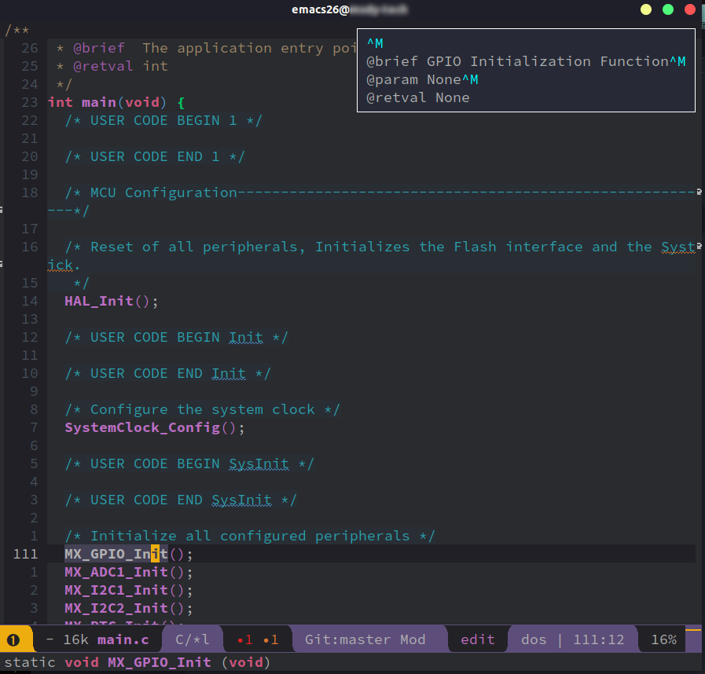

-   Argument filling
    
    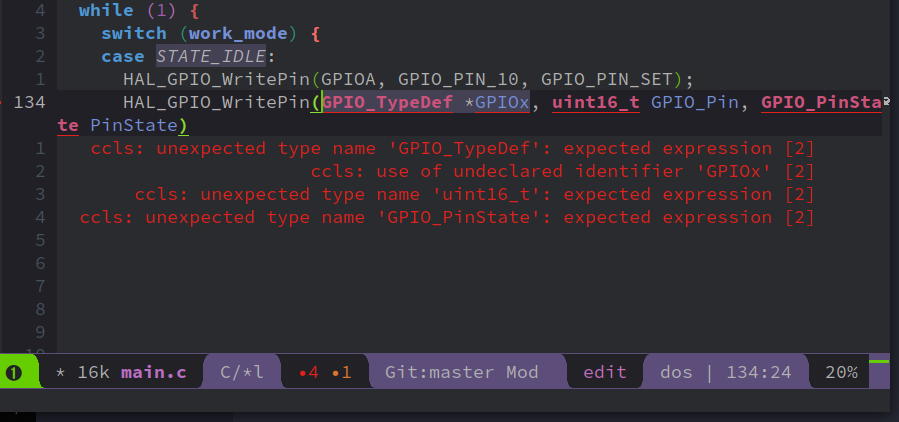
    
    After finish typing one, press <kbd>Tab</kbd> to jump to the next one. When the last one is finished, press <kbd>Tab</kbd> again to add the semicolon.

-   Semantic highlighting
    
    This is an option for the backend.
    
    Without semantic highlighting:
    
    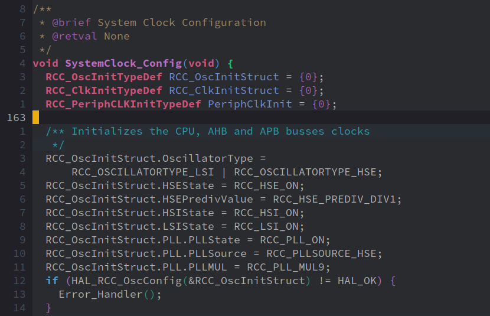
    
    With semantic highlighting:
    
    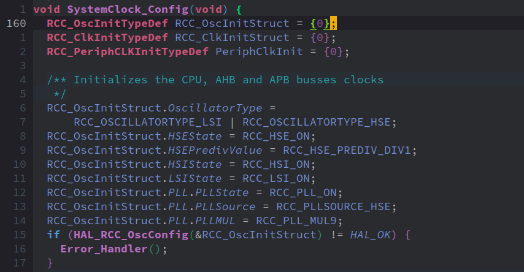
    
    With rainbow semantic highlighting:
    
    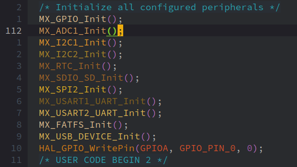

-   Completion with substring matching
    
    You don't need to type the exact words to trigger the completion. Typing the first letter of each word also works!
    
    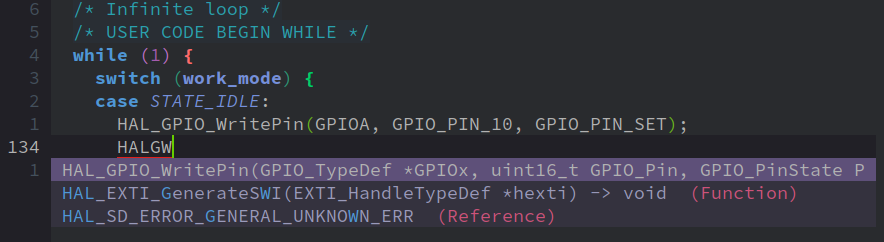

# Bonus

Keyboard shortcuts that I used frequently. (<kbd>,</kbd> is equivalent to <kbd>SPC m</kbd>)

-   <kbd>,ga</kbd>: jump to matched file (`sample.c` <-> `sample.h`)
-   <kbd>,gd</kbd>: jump to definition (provided by the `ccls`)
-   <kbd>gd</kbd>: jump to definition (provided by the default emacs backend)
-   <kbd>CTRL+o</kbd>: jump back to last position (e.g. return from "jump to definition")
-   <kbd>,==</kbd>: `clang-format-buffer`, makes your code complies with the coding standard.
-   <kbd>,gr</kbd>: find xref (cross reference), = other places that this function is also called.
