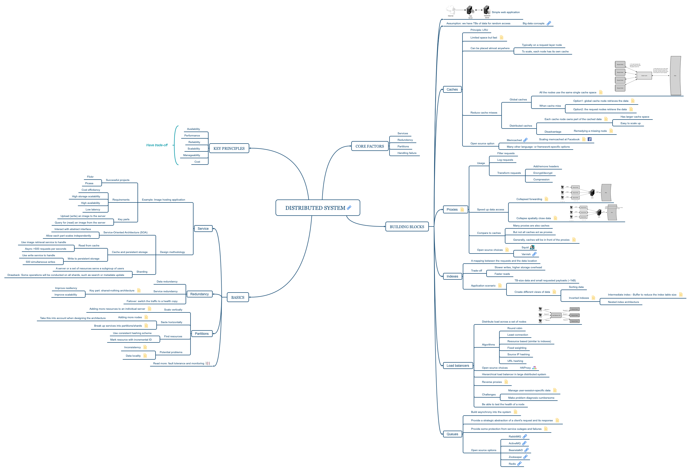

# Source

Original post: [Scalable Web Architecture and Distributed Systems](https://www.aosabook.org/en/distsys.html) (The Architecture of Open Source Applications: Elegance, Evolution, and a Few Fearless Hacks)

Author: Kate Matsudaira

# Mind Map

Drag it to a new tab to view larger image.

Other format:

-   [Original mindmap](../assets/post-img/distributed-system-basic-summary/distributed-system-note.xmind) (`.xmind` format).
-   [SVG](../assets/post-img/distributed-system-basic-summary/distributed-system.svg) (vector graphic).

The notes attached to each bullet point could not be exported to `.svg` format. So please visit the mindmap for more info.

However, everything is a subset of the original post. It's a great article and you may want to have a read.

# End

There is nothing I can add to this topic. Besides that, I think mind map is a great way to visualize the information and build the knowledge map. I would like to share more mindmap here in the future.
