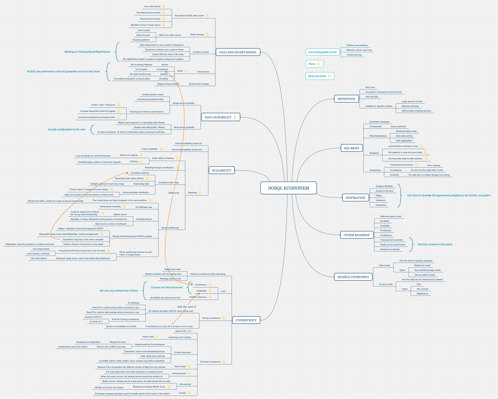

# Source

Original post: [The NoSQL Ecosystem](https://www.aosabook.org/en/nosql.html) (The Architecture of Open Source Applications: Elegance, Evolution, and a Few Fearless Hacks)

Author: Adam Marcus

# Mind Map

Drag it to a new tab to view larger image.

Other format:

-   [Original mindmap](../assets/post-img/nosql-ecosystem-summary/nosql-ecosystem.xmind) (`.xmind` format).
-   [SVG](../assets/post-img/nosql-ecosystem-summary/nosql-ecosystem.svg) (vector graphic).

Key points:

-   What is NoSQL ecosystem?
-   What is the roadmap?
-   What is its models?
-   How to guarantee consistency, availability, and partition tolerace?

The notes attached to each bullet point could not be exported to `.svg` format. So please visit the mindmap for more info.

However, everything in the mindmap is a subset of the original post. It's a great article and you may want to have a read.
