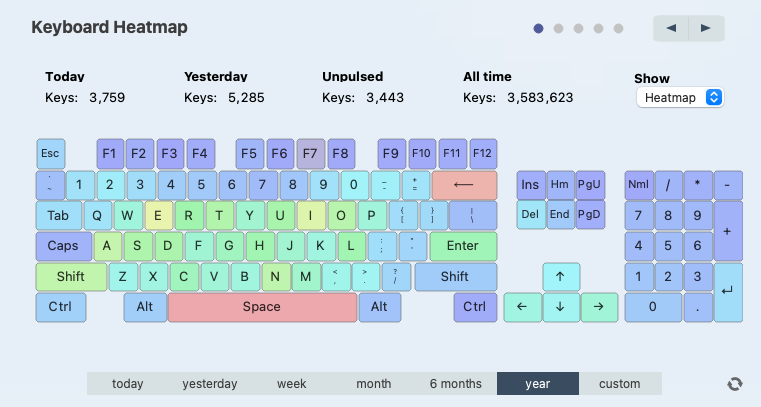

# Problem

I got a pop-up warning saying "Error while talking to website: Error creating SSL context ()" when I attempted to push (pulse) the key/mouse stats to the WhatPulse server. It have failed for about 2 mounths, so my unpulsed keys were about 570k.

Environment:

-   WhatPulse: 2.8.4
-   macOS: 11.0.1 Big Sur

# Solution

This problem is caused by an outdated SSL library in the Qt (GUI support for WhatPulse).

I solved this by enabling the "Include beta versions updates" in the WhatPulse setting, and then click "Check for Updates".

**Upgrading to 2.9beta3 resolves this problem**. Plus, the UI has been improved a lot.

