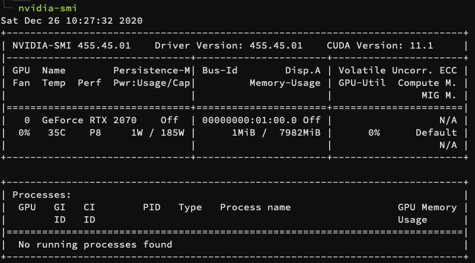

# TL;DR

This problem can be caused by many reasons, in my case:

Delete the file (if it exists) `/etc/modprobe.d/blacklist-nvidia.conf` and reboot.

# Problem

I accidentally `sudo apt update` and `sudo apt upgrade` on my ubuntu server. The Nvidia driver version was updated from 440 to 450+, and then later I found the Nvidia CUDA version changed in `nvidia-smi`, like this:



The CUDA version became "11.1", instead of the 10.1 that I installed on the server. Because one of the packages that my labmate uses depends strictly on the CUDA version (10.1), I realized that I "made a mistake" and decided to roll the update back.

After a series of operations and commands, I purged everything related to the "nvidia", "libcuda" and "cuda" and was going to install them back from scratch.

However, no matter how I installed the driver or rebooted the server, the command `nvidia-smi` just didn't work at all, showing the following error:

```shell
NVIDIA-SMI has failed because it couldn't communicate with the NVIDIA driver. Make sure that the latest NVIDIA driver is installed and running.
```

# Debug Process

Here are the possible solutions that I came across, but **didn't work** for me.

## Not rebooting after installing drivers

Related posts: <https://deeptalk.lambdalabs.com/t/nvidia-smi-has-failed-because-it-couldnt-communicate-with-the-nvidia-driver/148/8>

Yes, it does need a reboot to enable the drivers. But this didn't work for me. Same error after reboot.

## Reinstall drivers or CUDA libs

Another thought that came into my mind was the unmatched driver version. Maybe the driver is too new for an old device and vice versa. You can find lots of posts claiming this when you search the problem on the web.

Then I tried to install different versions of the driver.

-   440
-   450
-   460

None of them work, and the system may screw up when you got so many versions of the driver installed and uninstalled.

Quick note: do not install `nvidia-drivers-440` and `nvidia-drivers-440-server` together on the same machine, otherwise there will be a dependency issue that causes you to fail in both installing or uninstalling Nvidia-related packages.

## Updated Kernel not matching the old the Nvidia drivers

Many other posts say that, if you update the Linux kernel, the Nvidia driver that was installed during the older kernel period will not compatible with the updated kernel.

Related post: (Chinese) [ubuntu 关机开机后显卡挂了](https://www.jianshu.com/p/3cedce05a481).

The solution is to use use `dkms` (Dynamic Kernel Module Support) to install a new kernel-compatible files for the drivers, like this:

```shell
sudo apt-get install dkms
sudo dkms install -m nvidia -v <driver_version>
```

The driver version can be found by the command `whereis nvidia`.

However, this solution didn't work for me either, because even my driver was installed after the kernel update.

## Other solutions didn't work in my case

-   Some people solved this by disabling "secure boot" in BIOS ([Link](https://forums.developer.nvidia.com/t/nvidia-smi-has-failed-because-it-couldnt-communicate-with-the-nvidia-driver/70706/6)).
-   Install `nvidia-cuda-toolkit` ([Link](https://askubuntu.com/a/1129265)). Only works for older CUDA versions (<=9.2).

# Final Solution

Finally, I confirm that I made a mistake by running the command `sudo prime-select intel`. "nvidia" means the GPU I have, while "intel" means the integrated GPU in the CPU.

This will generate a file "blacklist-nvidia.conf" in `/etc/modprobe.d/` which prevents the Nvidia driver from loading during system boot.

My monitor connects to the HDMI port of the motherboard. I thought the `prime-select` command only affect how the GUI was processed, which is not. It also decides which driver that is actually loaded.

It turned out I deleted the Nvidia drivers after I `prime-select intel`, so I missed the chance to correct it (the command is no longer available).

To get it right, I deleted the blacklist file and run

```shell
sudo update-initramfs -u
```

Then reboot, everything works well, `nvidia-smi` back to normal.

Btw, I saw the hint in [this](https://forums.developer.nvidia.com/t/nvidia-smi-has-failed-because-it-couldnt-communicate-with-the-nvidia-driver/70706/4) and [this discussion threads](https://forums.developer.nvidia.com/t/black-screen-after-install-of-nvidia-driver-ubuntu/109312/3).

# Another Note

Later I realized ([from this post](https://stackoverflow.com/questions/53422407/different-cuda-versions-shown-by-nvcc-and-nvidia-smi)) that, the CUDA version shown in the `nvidia-smi` command is different from what is installed in the system. In short, the version in `nvidia-smi` is the **highest version** that the current Nvidia driver supports, not the one installed in the system.

In other words, there is nothing wrong after I updated the kernel and the `nvidia-drivers` at the very beginning. I just spent a whole night fixing an illusion or display "error".

S\*\*\*!
